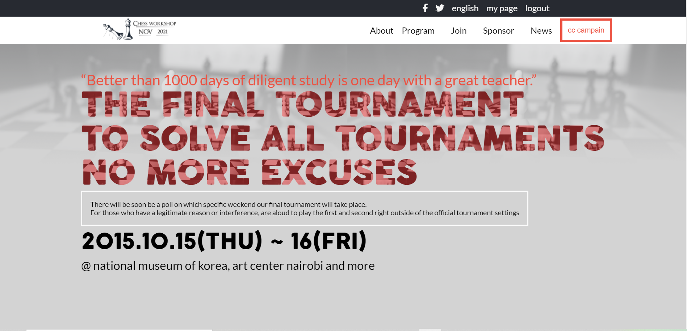

# Project Name

> Capstone projects

This is my microverse module capstone project, a site that i created for a chess tournament.

## Built With

- HTML
- CSS
- Nodejs
- NPM

## Live Demo

explanation video:
https://www.loom.com/share/9be9e71c09824f67ad244e16a35f8eca

## Live Demo

The project is deployed using github pages.

[Live Demo Link](https://timowest12.github.io/capstone/)

## Getting Started

If you want to use this portfolio as a template, you can do so; follow the instructions below.

### Usage

If you would likt to use this site for your own you can do so by downloading it at the top of this page as a zip, You can then unzip it and open it in a text or code editor to make the changes you like.

A pull request would be accepted if you can add nice fueteres, or have any othe good idea.

## Authors

👤 **Author1**

- GitHub: [@githubhandle](https://github.com/Timowest12)
- Twitter: [@twitterhandle](https://twitter.com/Timo61060367)
- LinkedIn: [LinkedIn](https://www.linkedin.com/in/timo-wester-6a0282a7/)

## 🤝 Contributing

Contributions, issues, and feature requests are welcome!

Feel free to check the [issues page](../../issues/).

## Acknowledgements

https://www.cindyshin.com/ whose design template was used is used for this project.

## Show your support

Give a ⭐️ if you like this project!

## 📝 License

This project is [MIT](./MIT.md) licensed.
